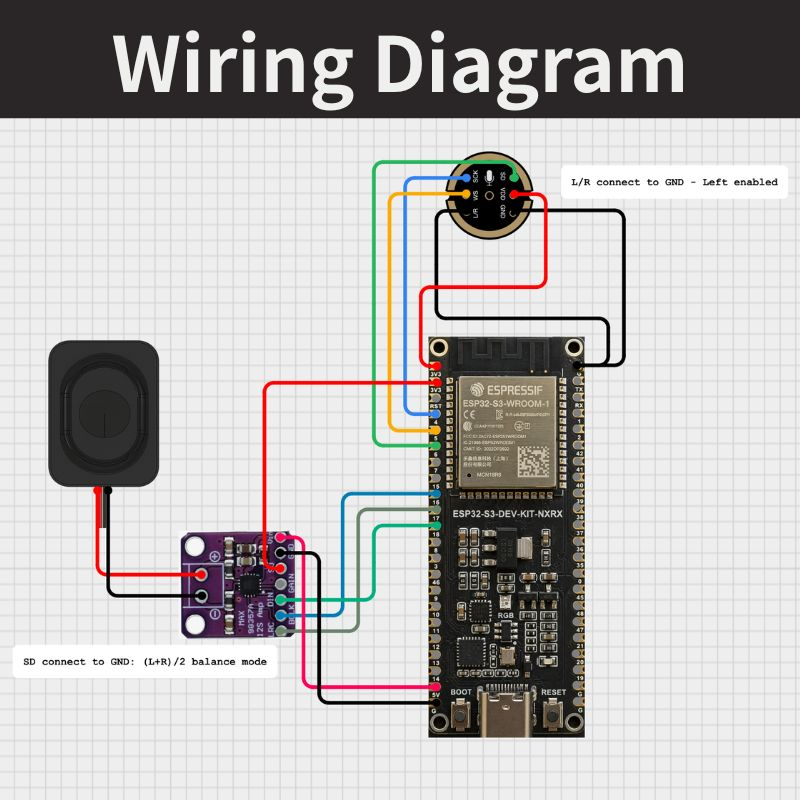

# ESP32-S3 Gemini Voice Assistant Demo

This project is a high-performance Voice Assistant demonstration built on the **ESP32-S3** platform. It integrates **Espressif's WakeNet** for offline wake-word detection, **Gemini 2.5 Flash** for advanced AI reasoning, and **Google TTS** for natural voice feedback.

## 🚀 Features
- **Offline Wake-word**: Powered by `esp-skainet` (Default: "Ni Hao Xiao Zhi").
- **Smart Conversational AI**: Leverages Google Gemini API for context-aware responses.
- **Natural Speech**: High-quality Chinese/English TTS via Google Text-to-Speech.
- **Optimized for S3**: Utilizes PSRAM for large buffer management and JSON parsing.

## 🛠️ Hardware Requirements

- **Core**: ESP32-S3 Development Board (Must have **8MB PSRAM**).
- **Mic**: INMP441 (I2S Digital Microphone).
- **Speaker**: MAX98357A I2S DAC + 4-8Ω Speaker.
- **LED**: WS2812B RGB LED (Status Indicator).

### 📍 Pin Mapping Reference

| Component | Pin Name | ESP32-S3 GPIO | Note |
| :--- | :--- | :--- | :--- |
| **INMP441 (Mic)** | SCK / WS / SD | GPIO 4 / 5 / 6 | I2S0 Input |
| **MAX98357A (Amp)** | BCLK / LRC / DIN | GPIO 16 / 17 / 18 | I2S1 Output |
| **WS2812B (LED)** | DIN | GPIO 38 | Status Indicator |
| **Power** | VCC / GND | 5V or 3.3V / GND | Common Ground is MUST |

## 📋 Prerequisites & Setup
This project depends on the **ESP-Skainet** component. Please follow these steps to set up the environment:

1.  **Install ESP-IDF**: Recommended version `v6.0` or later.
2.  **Clone ESP-Skainet**:
    ```bash
    git clone --recursive [https://github.com/espressif/esp-skainet.git](https://github.com/espressif/esp-skainet.git)
    ```
3.  **Project Location**: 
    Place this repository folder under `esp-skainet/examples/`.
4.  **API Keys**: 
    Update `GOOGLE_TTS_API_KEY` and `GEMINI_API_KEY` in the source code with your valid keys.
5.  **WiFi Credentials**: 
    Update `EXAMPLE_ESP_WIFI_SSID` and `EXAMPLE_ESP_WIFI_PASS`.

## ⚡ Build & Flash
```bash
idf.py set-target esp32s3
idf.py menuconfig # Configure your flash size (e.g., 8MB/16MB) and enable PSRAM
idf.py build
idf.py -p [PORT] flash monitor
